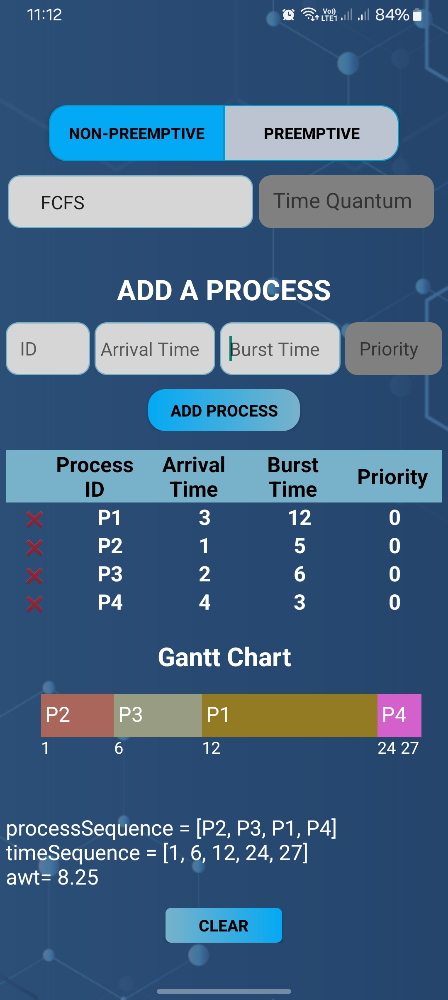
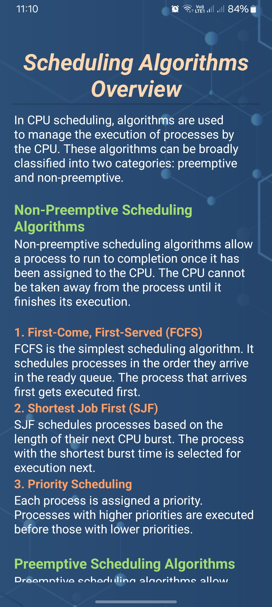

# CPU-Scheduling-Simulator
The CPU Scheduling Simulator app is designed to explore different CPU scheduling algorithms. It supports both preemptive and non-preemptive scheduling methods and provides a user-friendly interface to visualize scheduling processes with Gantt chart.

# Algorithms Covered
### Non-Preemptive Algorithms

1. **First-Come, First-Served (FCFS)**
   - The FCFS algorithm schedules processes in the order they arrive in the ready queue. Once a process starts its execution, it runs to completion. This is the simplest type of CPU scheduling algorithm.

2. **Shortest Job First (SJF)**
   - The SJF algorithm selects the process with the smallest burst time for execution next. If two processes have the same burst time, FCFS is used to break the tie. This algorithm can reduce the average waiting time for processes.

3. **Priority Scheduling**
   - In Priority Scheduling, each process is assigned a priority. The process with the highest priority (the smallest number) is selected for execution next. If two processes have the same priority, FCFS is used as a tiebreaker.

### Preemptive Algorithms

1. **Round Robin (RR)**
   - The Round Robin algorithm assigns a fixed time quantum to each process in the ready queue. A process is allowed to run for a time equal to the time quantum, then it is preempted and moved to the end of the queue if it still has remaining burst time. This ensures that all processes get an equal share of the CPU.

2. **Preemptive Shortest Job First (SJF) / Shortest Remaining Time First (SRTF)**
   - In the preemptive version of SJF, also known as Shortest Remaining Time First (SRTF), the process with the shortest remaining burst time is selected for execution next. This can lead to more efficient use of the CPU but requires more complex tracking of process burst times.

3. **Preemptive Priority Scheduling**
   - Similar to non-preemptive priority scheduling, but processes can preempt the currently running process if they have a higher priority (lower number). This allows high-priority processes to be executed as soon as they arrive.

# Getting Started
1. Download the APK file from [Releases](https://github.com/almahfuz777/CPU-Scheduling-Simulator/releases) section
2. Install it on your Android device

# Screenshots
Here are some screenshots showcasing the app's interface and features:

# Contributing
You are welcome for contributions to the project. If you find bug fixes, improvements, or new features, feel free to fork the repository and submit a pull request.
If you encounter any issues, please report them on our [Issues](https://github.com/almahfuz777/CPU-Scheduling-Simulator/issues)
 page.
